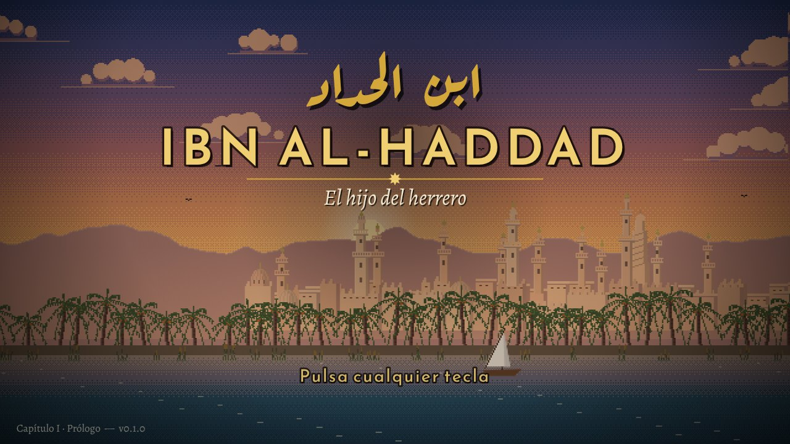
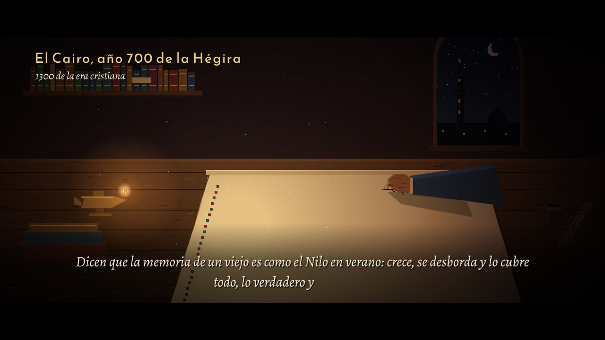
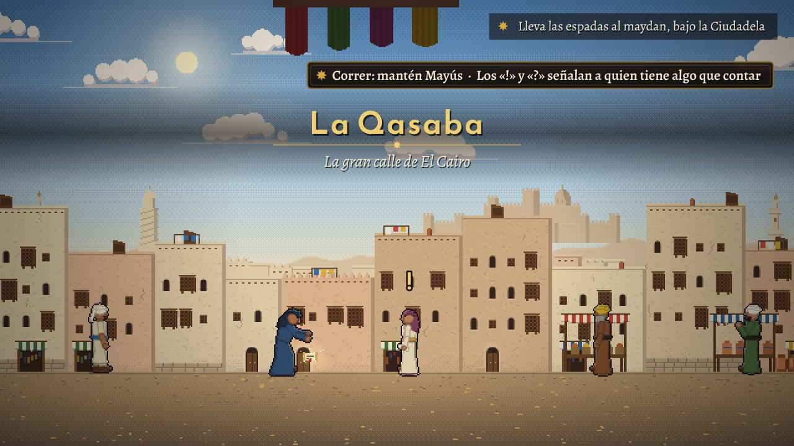
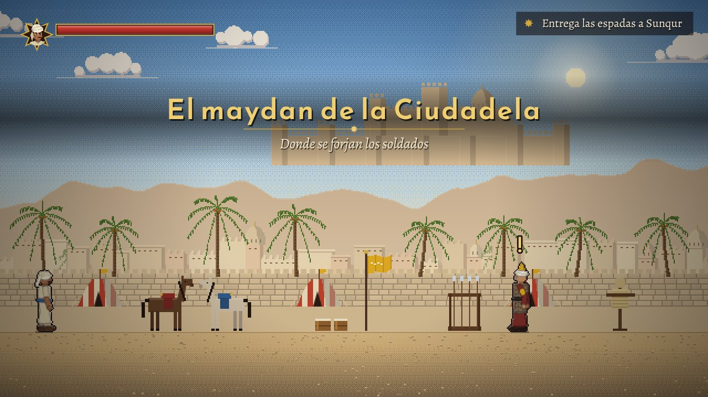
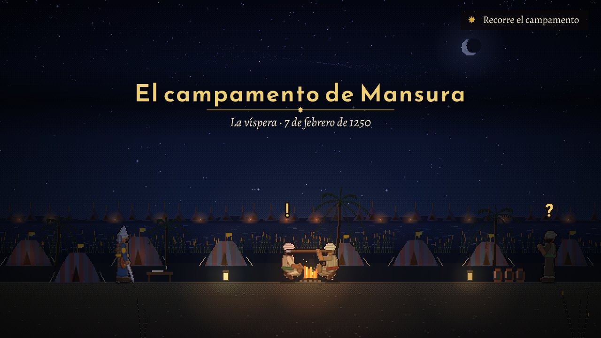
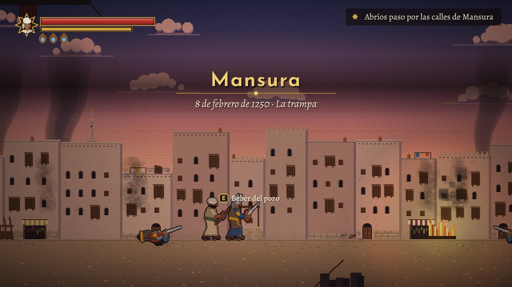

# Ibn al-Haddad — El hijo del herrero

Aventura de acción en 2D de desplazamiento lateral ambientada en el Egipto de 1249.
Yusuf, hijo de un herrero de El Cairo, se alista en el ejército del sultán cuando los cruzados de Luis IX toman Damieta, y vive desde dentro la batalla de Mansura, el nacimiento del sultanato mameluco y, más adelante, la guerra contra los mongoles.

**Estado:** Capítulo I · Prólogo completo y jugable de principio a fin (unos 45–60 minutos).

---

| | |
|---|---|
|  |  |
|  |  |
|  |  |

## Jugar ahora

| Forma | Cómo |
|---|---|
| Navegador (lo más rápido) | Abre `index.html` con doble clic. Funciona sin internet en Chrome, Edge y Firefox. |
| Servidor local | `npm run web` y entra en `http://localhost:8080` |
| Versión de escritorio (la de Steam) | `npm install` una vez y después `npm start` |

Pulsa **F11** para pantalla completa. Se juega con teclado o con mando (Xbox, PlayStation, Steam Deck).

## Controles

| Acción | Teclado | Mando |
|---|---|---|
| Moverse | A / D · ← → | Stick izquierdo |
| Saltar | Espacio | Ⓐ |
| Hablar / interactuar | E · W · ↑ | Arriba |
| Ataque (combo de 3) | J · clic izquierdo | Ⓧ |
| Golpe fuerte (rompe guardias) | K · clic derecho | Ⓨ |
| Bloquear (y **parada** si es justo a tiempo) | L (mantener) | LB / RB |
| Voltereta | Mayús izquierda | Ⓑ |
| Beber del odre (curarse) | Q | Select |
| Correr en la ciudad | Mayús (mantener) | Ⓑ (mantener) |
| Pausa | Esc | Start |

## Qué hay en el Prólogo

1. **Cinemática de apertura** — Yusuf, ya anciano, escribe su crónica en el año 1300. Un mapa animado explica el mundo de 1249: los ayyubíes, los mamelucos, la cruzada de Luis IX, la caída de Damieta y la enfermedad del sultán. Las frases se escriben con calma y se quedan en pantalla el tiempo de leerlas (se puede elegir narración automática o manual).
2. **La forja de Ibrahim** — tutorial con tres minijuegos: avivar el fuego, martillar la hoja al ritmo y templarla en el momento justo.
3. **La Qasaba de El Cairo** — calle viva con mercado, aguador, cuentacuentos, músico, palomas, gatos y gallinas; la proclama del sultán y una persecución por los tejados detrás de un niño ladrón.
4. **El maydan de la Ciudadela** — entrenamiento de combate con Sunqur, el viejo mameluco: combo, golpe fuerte, bloqueo, parada y voltereta.
5. **La despedida** — el padre entrega a Yusuf la espada *Sabr* («paciencia»); Nur le regala un cálamo para que le escriba.
6. **Cinemáticas del viaje** — la salida por Bab al-Futuh, la marcha junto al Nilo, la muerte oculta del sultán y el invierno frente a los cruzados.
7. **El campamento de Mansura** — la víspera: Hamid, el lanzador de fuego griego, la carta a Nur y la aparición de Baibars.
8. **La batalla de Mansura** — la trampa de Baibars en las calles: tres combates, ballesteros en los balcones, vecinos que tiran piedras desde las azoteas, un caballero y el jefe templario Thibaut de Clermont, con una decisión final.
9. **Epílogo** — Fariskur, la captura de Luis IX, el fin de los ayyubíes… y el avance de los mongoles hacia Bagdad.

Además: **22 Crónicas** históricas coleccionables (se leen en el menú), 6 logros, tres dificultades, guardado automático con puntos de control.

## Cómo está hecho

- **Sin dependencias ni motores de terceros**: HTML5 Canvas y JavaScript. Pesa unos 2 MB, y la mayor parte son las fuentes.
- **Arte procedural en pixel art**: cada personaje es un esqueleto animado (túnica, turbante, cota de malla, escudo…) que se dibuja y se «hornea» a pixel art al cargar, con contorno y luz de borde. Escenarios con parallax, iluminación dinámica (fragua, hogueras, faroles) y láminas animadas para las cinemáticas.
- **Música sintetizada en tiempo real** con instrumentos de la época (oud, qanun, ney, rebab, darbuka, riq, tabl, naqqara, nafir) y escalas árabes reales (*maqamat* Hijaz, Bayati, Rast, Saba y Kurd, con cuartos de tono).
- **Rigor histórico**: fechas, lugares y personajes reales verificados; se evitan anacronismos (Bab Zuwayla aparece sin los alminares de 1415, no hay café en El Cairo de 1249, las espadas son rectas…).

## Estructura

| Carpeta | Contenido |
|---|---|
| `index.html`, `css/` | Página del juego |
| `js/motor/` | Núcleo (bucle, escalado, escenas), entrada, audio, partículas, texto |
| `js/arte/` | Esqueleto y animaciones, trajes, retratos, escenarios, objetos, láminas, música |
| `js/juego/` | Zonas jugables, entidades y combate, guiones, cinemáticas, minijuegos, menús, guardado |
| `js/capitulos/` | El contenido: crónicas, cinemáticas y zonas del Prólogo |
| `fuentes/` | Tipografías con licencia libre (SIL OFL) |
| `electron/` | Envoltorio de escritorio para Steam |
| `herramientas/` | Prueba automática y visores de sprites, retratos y escenarios |

### Atajos de desarrollo

Añade al final de la dirección:

- `#zona=calles&entrada=desdeForja&traje=yusuf&banderas=forjaHecha` — empieza en una zona concreta
- `#cine=intro` — reproduce una cinemática (`intro`, `noche`, `partida`, `vado`, `epilogo`)
- `#depurar` — muestra los FPS

Visores: `herramientas/galeria.html` (personajes), `herramientas/retratos.html`, `herramientas/fondos.html?escena=cairo`.

### Prueba automática

```bash
npm i -D playwright
npm run probar
```

Recorre todas las zonas y cinemáticas, comprueba que no haya errores y guarda capturas en `herramientas/capturas/`.

## Publicar en Steam

1. Darte de alta en **Steamworks** (Steam Direct: 100 USD por juego) y obtener el **App ID**.
2. `npm install` y `npm run dist:win` (o `dist:linux` / `dist:mac`). El ejecutable queda en `dist/`.
3. Para integrar Steam (logros, superposición): `npm install steamworks.js` y crear `steam_appid.txt` con el App ID junto al ejecutable. El juego funciona igual sin Steam.
4. Crear en Steamworks los logros con estos identificadores: `FORJA_MAESTRA`, `PRIMERA_PARADA`, `VECINO_CURIOSO`, `PIEDAD`, `PROLOGO`, `CRONISTA`.
5. Subir la compilación con SteamPipe y preparar la página de la tienda (las capturas de `herramientas/capturas/` sirven de punto de partida).

El juego admite mando de serie, así que debería obtener el sello de compatibilidad con Steam Deck sin cambios.

## Licencias

Código y contenido: © crepigold, todos los derechos reservados. Tipografías: SIL Open Font License (ver `fuentes/LICENCIA_FUENTES.txt`), uso comercial permitido.

Más detalles del diseño, la historia completa prevista y las preguntas abiertas en [`DISENO.md`](DISENO.md).
